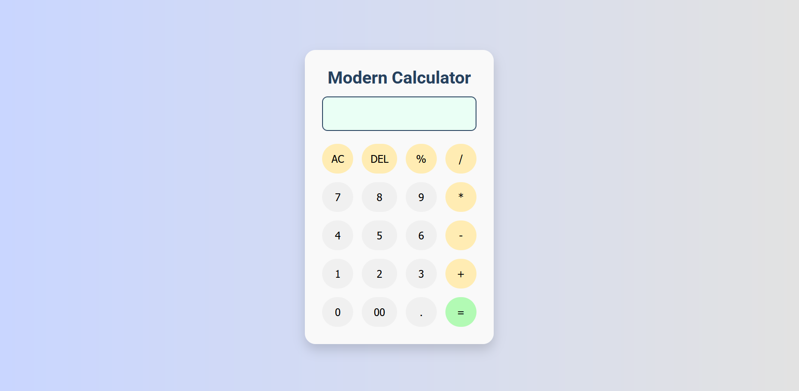

# 🔢 Modern Calculator

A sleek, modern, and fully functional calculator built using **HTML**, **CSS**, and **JavaScript**. Designed to be responsive and user-friendly, with protection against invalid expressions like `++`, `--`operator.

---

## 🚀 Features

- ✅ Clean and modern UI
- ✅ Fully functional basic calculator
- ✅ Error handling (prevents `++`, `--`, etc.)
- ✅ Prevents evaluation of incomplete expressions
- ✅ Keyboard and mouse input support *(optional future update)*
- ✅ Responsive for desktop and mobile

---

## 📂 Project Structure

Modern Calculator/
│
├── index.html # HTML structure
├── style.css # CSS styling
├── script.js # JavaScript logic
├── LICENSE # MIT License
├── README.md # You're reading this!
└── screenshot.png # Calculator preview image

---

## ⚙️ How It Works

- All button clicks are captured via `event listeners`.
- Input is appended to an `expression` string.
- `eval()` is used safely to evaluate expressions.
- Double operators like `++` or `--` are **blocked**.
- Expression ending in operator (e.g. `5+`) won’t be evaluated.

---

## 📸 Preview

> 
---

## 📄 License

This project is licensed under the [MIT License](./LICENSE).

---

## 🤝 Contribution

Pull requests are welcome! For major changes, please open an issue first to discuss what you would like to change.

---

## 🌐 Live Demo 

 [Netlify](https://moderncalculatorr.netlify.app/), 

---

Happy Calculating! 😊

